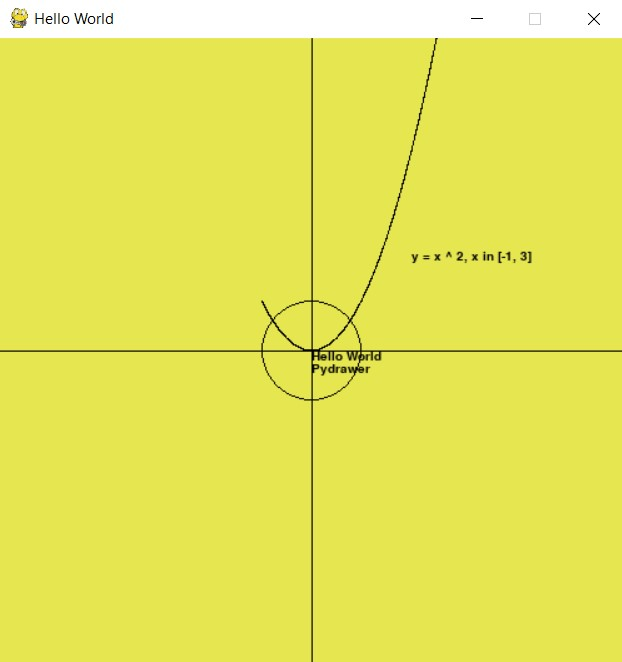

# PyDrawer


## The simplest gui
Created to simplify the creation of gui applications using python.
The simplest functionality is provided for fast lightweigth apps.
It can be usefull if you want to quick throw some idea of yours on the draft.


## Requirements
- ```pip install pygame```


## Example

```python
from app.graphics.figure.value import Size, Color, Point, Vector
from app.graphics.figure import Circle
from app.graphics import Surface, Transformed
from app.control import Event
from app import PyApp


class HelloWorld(PyApp):
    def __init__(self):
        self.W = 500
        self.H = 500
        super().__init__(
            title='Hello World',
            window_size=Size(self.W, self.H),
            fps=60
        )

    def on_event(self, event: Event):
        if event.type == Event.Type.QUIT:
            self.stop()

    def on_draw(self, surface: Surface):
        surface.fill(Color(230, 230, 80))
        Transformed.scaled(
            Transformed.xoy(
                origin = surface.draw(),
                center = Point(
                    x = self.W / 2,
                    y = self.H / 2
                )
            ).text(
                position = Point(0, 0),
                text = 'Hello World'
            ).text(
                position = Point(0, -10),
                text = 'Pydrawer'
            ).circle(
                circle = Circle(
                    center = Point(0, 0),
                    radius = 40
                ),
                width = 1
            ),
            scale = Vector(40, 40)
        ).line(
            start = Point(-10, 0),
            end = Point(10, 0)
        ).line(
            start = Point(0, -10),
            end = Point(0, 10)
        ).lines(
            points = (
                Point(x, x ** 2) for x in map(
                    lambda x: x / 1e4, (n for n in range(-1e4, 3e4))
                )
            )
        ).text(
            position = Point(2, 2),
            text = "y = x ^ 2, x in [-1, 3]"
        )


if __name__ == '__main__':
    app = HelloWorld()
    app.run()

```


